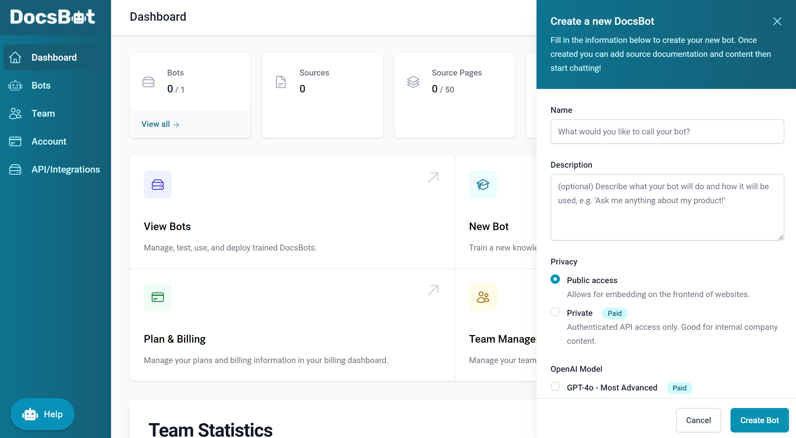
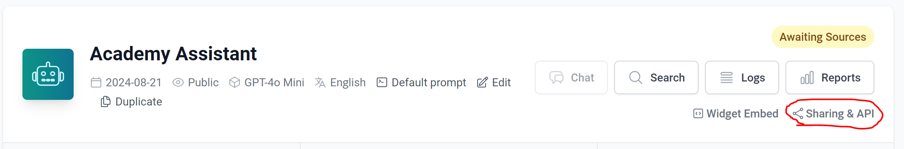
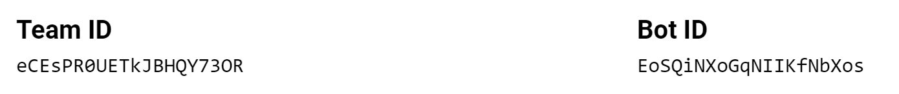
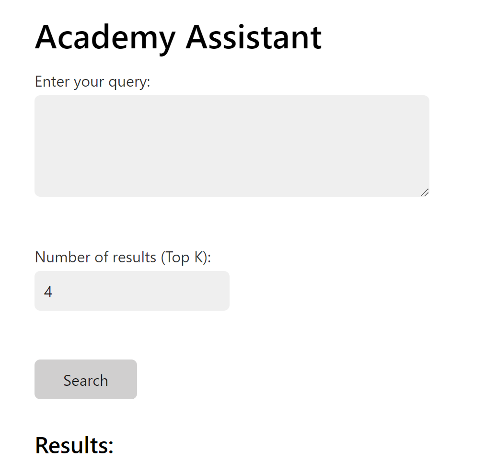
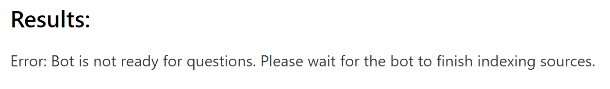
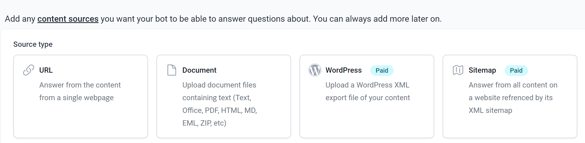
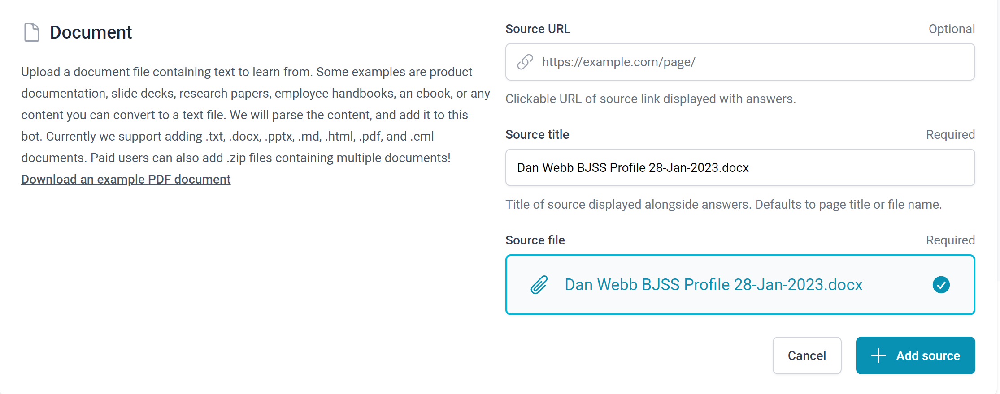
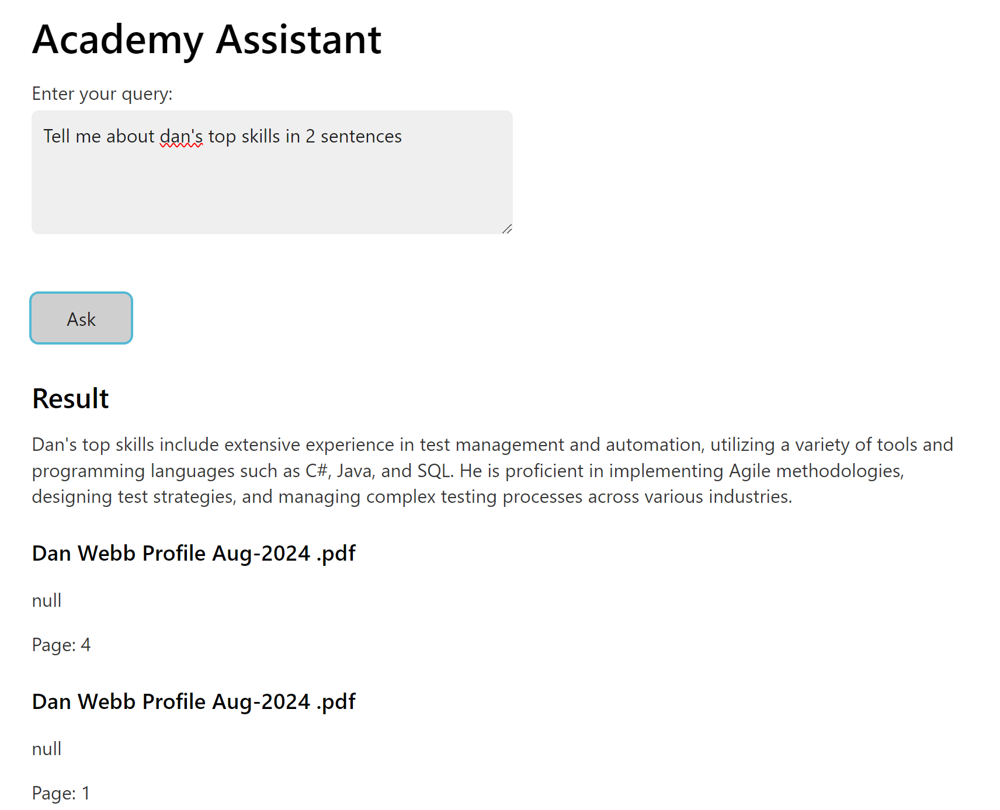

# A Simple RAGbot

Retrieval-Augmented Generation (RAG) is a method used in AI and natural language processing (NLP) to enhance the ability of a model to generate accurate and relevant text. 

In essence, RAG allows you to "narrow" the scope of your answer to the documents or data you have provided to your Large Language Model (LLM).

There are - ata simple level - two steps to this:

## 1. Retrieval

When a question or query is posed, the system first searches a large database or set of documents to find the most relevant information related to that query - like looking up information in a library or on the internet to get the best possible sources.

## 2. Generation

After retrieving the relevant information, the system uses this data to generate a detailed and coherent response. The AI *combines* its understanding of the question with the retrieved data to produce a more accurate answer.

### Like Writing an Essay

Imagine you're writing an essay at school (or a report) on a certain topic. First, you'd gather information by looking up books, articles, and notes - this is the retrieval part. Then, you use the information you've found to write your report in your own words - this is the generation part.

RAG does something similar but in an automated way, helping AI to give better and more informed answers by using both existing information and its language abilities.

---

## Getting Started

To generate a RAGbot, you first need to provide it with data, such as your documents, to create you own "library" if you will. 

Now, rather than talk about vectorising data and lots of various maths, we're going to use a free host to do all this for us.

Head over to [Docsbot AI](https://docsbot.ai/) and sign up for a free account.

Once signed up, you can start creating your bot:



Add a name and description for your bot (I used *Academy Assistant*) and left the description blank. Leave everything else as default and click Create Bot.

To be able to communicate with our bot, we are going to need the API endpoint. Click on the link to show it:



Make a note of these, you'll need them later:



## Connecting to our bot

Okay, even though we don't have any documents set up, we want to check that we can connect to our bot.

To make this easier, we've provided a complete skeleton for you. Create a new folder, and inside that create a file named `index.html`. Copy the below into the file:

```html
<!DOCTYPE html>
<html lang="en">

<head>
    <meta charset="UTF-8">
    <meta name="viewport" content="width=device-width, initial-scale=1.0">
    <title>Academy Assistant</title>
    <link rel="stylesheet" href="https://cdn.jsdelivr.net/npm/water.css@2/out/water.css">
</head>

<body>
    <h1>Academy Assistant</h1>

    <form id="query-form">
        <label for="query-input">Enter your query:</label><br>
        <textarea id="query-input" name="query" required rows="4" cols="50"></textarea><br><br>

        <button type="submit">Ask</button>
    </form>

    <h2>Result</h2>
    <div id="results"></div>

    <script>
        document.getElementById('query-form').addEventListener('submit', async function (event) {
            event.preventDefault();

            const team_id = "YOUR_TEAM_ID";
            const bot_id = "YOUR_BOT_ID";

            const url = 'https://api.docsbot.ai/teams/' + team_id + "/bots/" + bot_id + "/chat";

            const query = document.getElementById('query-input').value;
            const requestBody = {
                question: query,
                full_source: false
            };

            try {
                const response = await fetch(url, {
                    method: 'POST',
                    headers: {
                        'Content-Type': 'application/json'
                    },
                    body: JSON.stringify(requestBody)
                });

                const result = await response.json();

                const resultsDiv = document.getElementById('results');
                resultsDiv.innerHTML = '';

                if (response.ok) {
                    const resultText = document.createElement('div');
                    resultText.innerHTML = result.answer;
                    resultsDiv.appendChild(resultText);
                    result.sources.forEach(item => {
                        const resultItem = document.createElement('div');
                        resultItem.innerHTML = `
                            <h3>${item.title || 'Untitled'}</h3>
                            <p>${item.content}</p>
                            ${item.url ? `<p><a href="${item.url}" target="_blank">Source</a></p>` : ''}
                            ${item.page ? `<p>Page: ${item.page}</p>` : ''}
                        `;
                        resultsDiv.appendChild(resultItem);
                    });
                } else {
                    resultsDiv.innerHTML = `<p>Error: ${result.error || 'Something went wrong'}</p>`;
                }
            } catch (error) {
                console.error('Error fetching data:', error);
                document.getElementById('results').innerHTML = `<p>Error: ${error.message}</p>`;
            }
        });
    </script>
</body>

</html>
```

Now, from when we set up our RAGbot, we had our Team Id and Bot Id. We need to replace our placeholders in `index.html` with the actual values:

```js
const team_id = "YOUR_TEAM_ID";
const bot_id = "YOUR_BOT_ID";
```

Now if we save our `index.html` file, and double-click it to run it in a browser:



Okay, looking good. Now, let's add some text into the texarea where it says `Enter your query` and click the Search button:



Good news! We have proved our connection. Now we just need to add some documents to retrieve from!

## Adding data sources

Now of course we need to add some data - or sources - for our bot to create a response from. Head bac over to docsbot.ai and you'll see whilst it can take data from lots of different sources we are limited in the free mode:



> Be aware, whatever you upload is on a *public* API endpoint. Be very careful about what you upload and ensure it doesn't have things like credentials and passwords!

I'm going to upload my CV and suggest you do something the same:



Click Add Sources button to complete the upload.

Once the document is indexed, you can re-open your `index.html` page and start asking questions based on the documents the bot has. 



> You'll might get an error if it's still indexing! Give it a minute.

---

## Conclusion

We have set up a very simple RAGbot that allows us to add documents that our LLM will then use as its sources. 

At the moment our bot is *very* simple and doesn't have a concept of the history of conversation and treats every request as a brand new conversation. If you want to add *context* to your bot, you'll need to include the history of what has previously been sent. More information can be [found here](https://docsbot.ai/documentation/developer/chat-api#follow-up-questions).

There's also a chatbot widget that you can embed in your own website, making it easier for your users to interact with your bot: https://docsbot.ai/documentation/developer/embeddable-chat-widget

